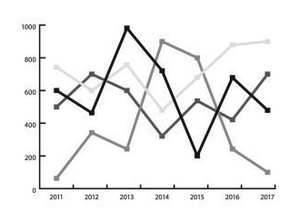

# MyFi - AI-Powered Expense Tracker

MyFi is a Chrome extension that automatically tracks your spending by scanning your email receipts. It uses AI to extract key information from your receipts and provides you with visual insights into your spending habits.

## Features

- **Automatic Receipt Scanning:** Scans your Gmail for receipts from popular vendors.
- **AI-Powered Data Extraction:** Uses the Gemini AI to accurately extract transaction details like merchant, date, amount, and category.
- **Visual Spending Insights:** Displays your spending breakdown with interactive charts and graphs.
- **Personalized Savings Tips:** Provides actionable tips to help you save money based on your spending patterns.
- **Secure and Private:** All your data is processed locally and stored securely in your browser.

## Getting Started

- **[How it Works](docs/how-it-works.md):** Learn about the technical details of the extension.
- **[Project Structure](docs/project-structure.md):** Get an overview of the project's file structure.
- **[Setup and Installation](docs/setup.md):** Follow the instructions to install and run the extension.

## Contributing

Contributions are welcome! Please feel free to open an issue or submit a pull request.
