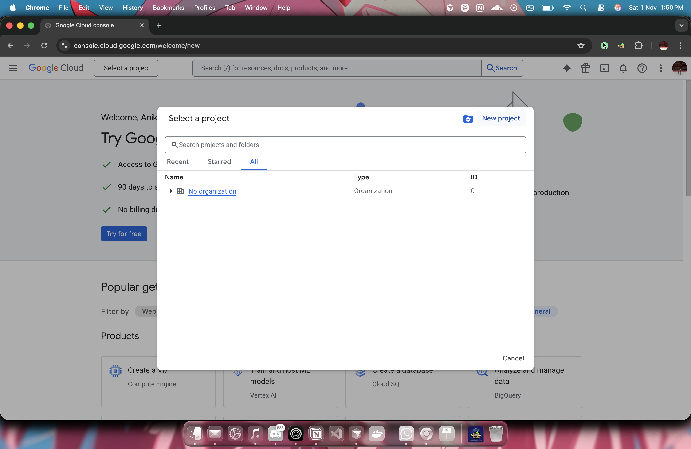
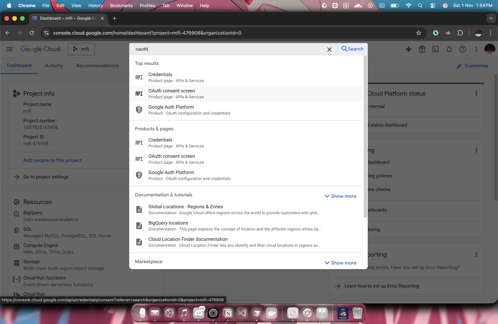
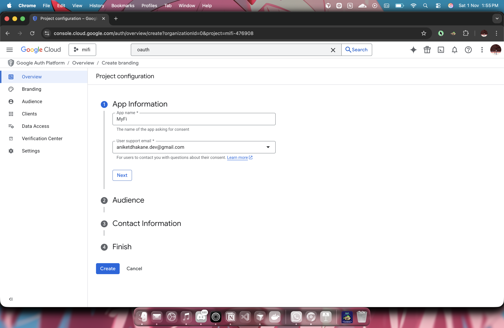
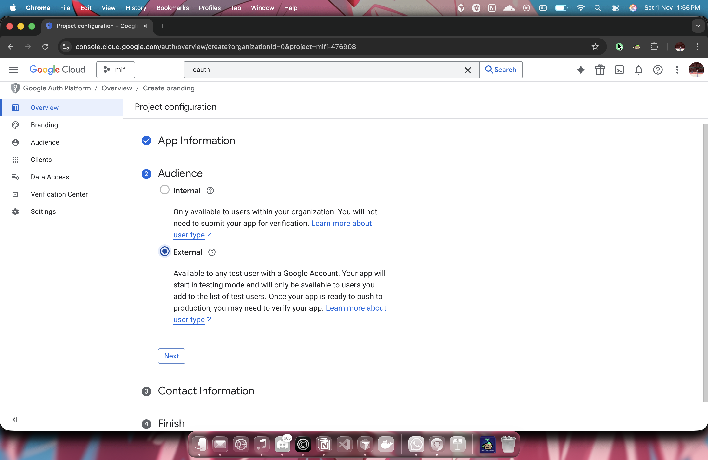
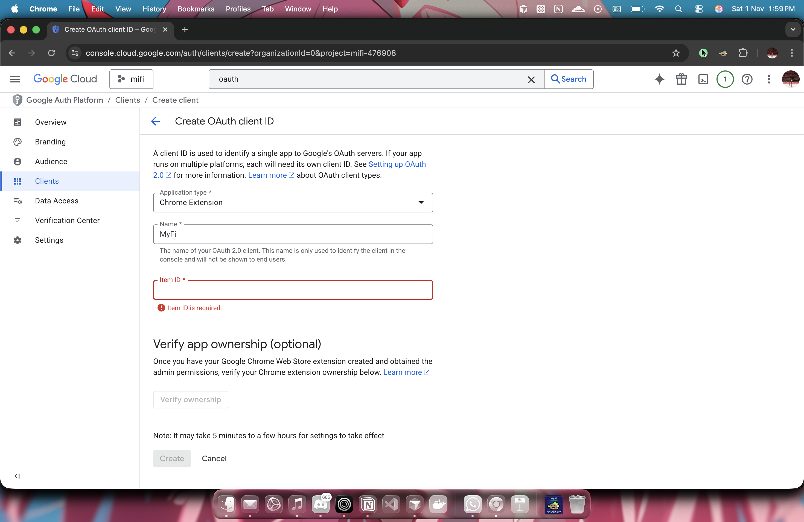
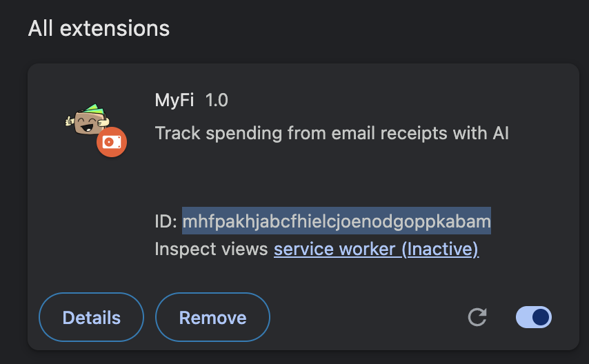
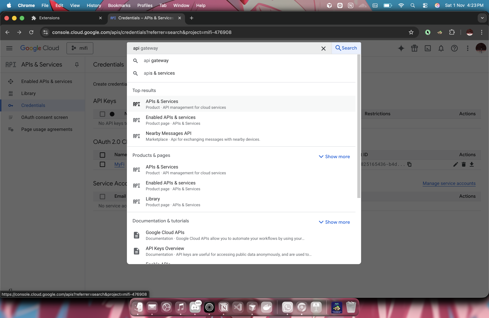
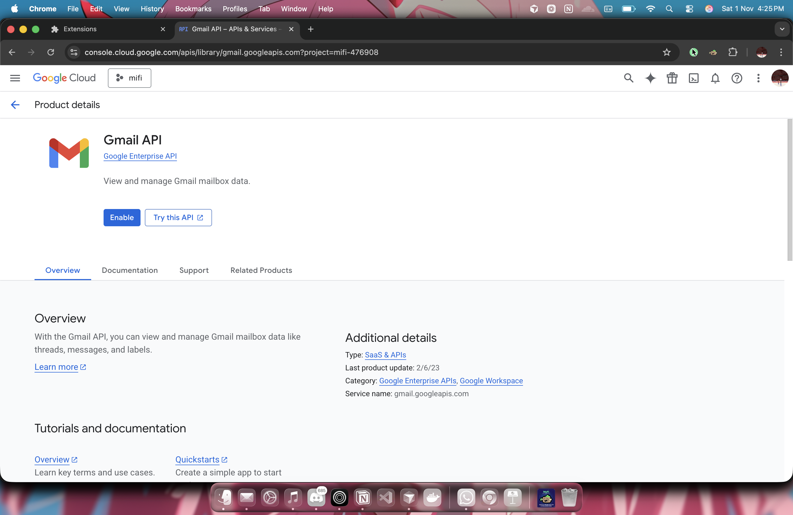

# Setup and Installation

Follow these instructions to set up and install the MyFi Chrome extension.

## Prerequisites

- [Google Chrome](https://www.google.com/chrome/)
- A Google account

## Installation

1.  **Clone the repository:**

    ```bash
    git clone https://github.com/your-username/myfi.git
    ```

2.  **Open Chrome extensions:**

    - Open Google Chrome and navigate to `chrome://extensions`.

3.  **Enable Developer mode:**

    - In the top right corner, toggle the "Developer mode" switch to the on position.

4.  **Load the extension:**

    - Click the "Load unpacked" button.
    - Select the directory where you cloned the repository.

5.  **Pin the extension:**

    - Click the puzzle piece icon in the Chrome toolbar to open the extensions menu.
    - Find "MyFi" and click the pin icon to keep it visible in your toolbar.

6. **Now open Google Cloud Console in new tab:**

    - Setup a new project
    
    - Now goto OAuth Consent Screen and finish with the setup
    
    
    
    - Once the setup Finishes click on Create OAuth Client
    
    - Here the Item ID would be the extension ID which you get on your chrome extensions tab
    
    - Once Finished creating, you will get a client ID, copy it and paste it in `manifest.json` on line 27
    - Finish the creation process and then search for API's and head to API's & services
    
    - Here Enable APIs and search for gmail api and enable it
    
    - Once done, head to google ai studio and get a free gemini api key by going on the link below
    `https://aistudio.google.com/app/api-keys`
    - Paste that link on line 90 in `background.js` and you are all set.

## Usage

1.  Click the MyFi icon in your Chrome toolbar to open the extension.
2.  Click the "Scan Receipts" button to start the scanning process.
3.  Sign in to your Google account and grant the necessary permissions.
4.  The extension will then scan your emails and display your spending insights.
